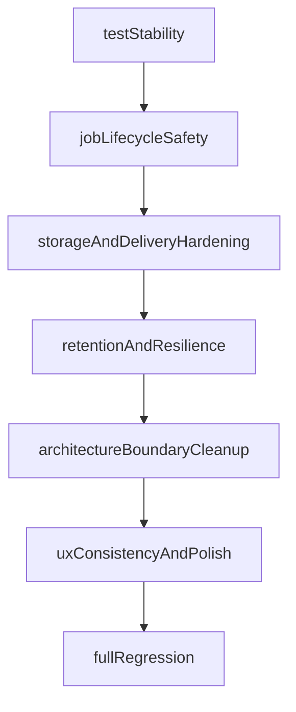

# Full Review Findings Remediation Plan

**Goal:** Fix all unresolved findings from [docs/review/202603022032.md](docs/review/202603022032.md) and [docs/review/202603022034.md](docs/review/202603022034.md), while keeping implementation aligned with [SPEC.md](SPEC.md), [docs/HIGH-LEVEL-IMPLEMENTATION-STRATEGY.md](docs/HIGH-LEVEL-IMPLEMENTATION-STRATEGY.md), and [docs/ARCHITECTURE.md](docs/ARCHITECTURE.md).

**Execution constraints**

- Use strict test-first flow per fix: failing test -> minimal fix -> pass -> refactor.
- Preserve clean boundaries from [docs/ARCHITECTURE.md](docs/ARCHITECTURE.md): Presentation depends on Domain contracts, Infrastructure implements Domain gateways.
- Keep imports at file top (no inline imports).

## Dependency Order

## Work Package 1 - Stabilize test harness and eliminate crash vectors (P1 gate)

**Primary files**

- [Tests/Presentation/JobListViewModelTests.swift](Tests/Presentation/JobListViewModelTests.swift)
- [Tests/Helpers/MockStorageGateway.swift](Tests/Helpers/MockStorageGateway.swift)
- [Tests/Helpers/MockTranscriptionGateway.swift](Tests/Helpers/MockTranscriptionGateway.swift)
- [Tests/Helpers/MockDeliveryGateway.swift](Tests/Helpers/MockDeliveryGateway.swift)
- [Tests/Helpers/MockSettingsGateway.swift](Tests/Helpers/MockSettingsGateway.swift)
- [Tests/Helpers/MockURLProtocol.swift](Tests/Helpers/MockURLProtocol.swift)
- [Tests/Infrastructure/DeliveryTests.swift](Tests/Infrastructure/DeliveryTests.swift)

**Steps**

1. Reproduce the historical `swift test` signal-11 failure with filtered runs and isolate the unstable suite(s).
2. Replace unsafe mutable shared mock state (`@unchecked Sendable` + mutable arrays/dicts) with actor/lock-backed test doubles.
3. Remove sleep-based async assertions in `JobListViewModel` tests; switch to deterministic completion hooks.
4. Remove `fatalError` fallback in `MockURLProtocol` and convert to assertion-friendly failure behavior.
5. Pin AppKit clipboard tests to main actor where needed.

**Exit criteria**

- Stable targeted test suites (no crash, no timing flakes).
- Test harness is safe enough to support later concurrency refactors.

## Work Package 2 - Own task lifecycle, cancellation semantics, and drop concurrency safety

**Primary files**

- [trnscrb/Presentation/ViewModels/JobListViewModel.swift](trnscrb/Presentation/ViewModels/JobListViewModel.swift)
- [trnscrb/Presentation/Popover/JobListView.swift](trnscrb/Presentation/Popover/JobListView.swift)
- [trnscrb/Presentation/Popover/DropZoneView.swift](trnscrb/Presentation/Popover/DropZoneView.swift)
- [trnscrb/Presentation/Popover/PopoverView.swift](trnscrb/Presentation/Popover/PopoverView.swift)
- [trnscrb/App/StatusBarDropView.swift](trnscrb/App/StatusBarDropView.swift)
- [Tests/Presentation/JobListViewModelTests.swift](Tests/Presentation/JobListViewModelTests.swift)

**Steps**

1. Add explicit task ownership in `JobListViewModel` (per-job task registry) and cancellation-aware delete/clear behavior.
2. Ensure deleting active jobs cancels underlying pipeline work, not only UI rows.
3. Remove `nonisolated(unsafe)` and unsynchronized array mutation in drop handlers by introducing a main-actor-safe or actor-backed drop extraction path.
4. Surface unsupported file drops as explicit user-facing error state instead of silent filtering.
5. Add regression tests for active delete cancellation, clear-completed behavior, and unsupported file rejection.

**Exit criteria**

- No hidden background work after deletion.
- No unsynchronized drop URL aggregation.

## Work Package 3 - Correct app-shell behavior and popover semantics

**Primary files**

- [trnscrb/App/AppDelegate.swift](trnscrb/App/AppDelegate.swift)
- [trnscrb/App/TrnscrbrApp.swift](trnscrb/App/TrnscrbrApp.swift)
- [trnscrb/App/StatusBarDropView.swift](trnscrb/App/StatusBarDropView.swift)

**Steps**

1. Fix popover dismissal behavior during cross-app drag (adopt drag-safe strategy: prefer `.semitransient` + monitor cleanup, fallback to drag-aware monitor only if needed).
2. Remove blank Settings scene (`EmptyView`) so app menu / `Cmd-,` no longer opens an empty window.
3. Improve status item accessibility labels for VoiceOver clarity.
4. Ensure popover activation/focus behavior after drop is consistent.

**Exit criteria**

- Drag-from-Finder to app remains stable.
- No blank settings window path remains.

## Work Package 4 - Harden storage and file delivery correctness

**Primary files**

- [trnscrb/Infrastructure/Storage/S3Client.swift](trnscrb/Infrastructure/Storage/S3Client.swift)
- [trnscrb/Infrastructure/Delivery/FileDelivery.swift](trnscrb/Infrastructure/Delivery/FileDelivery.swift)
- [trnscrb/Domain/Gateways/StorageGateway.swift](trnscrb/Domain/Gateways/StorageGateway.swift)
- [trnscrb/Domain/UseCases/ProcessFileUseCase.swift](trnscrb/Domain/UseCases/ProcessFileUseCase.swift)
- [Tests/Infrastructure/S3ClientTests.swift](Tests/Infrastructure/S3ClientTests.swift)
- [Tests/Infrastructure/DeliveryTests.swift](Tests/Infrastructure/DeliveryTests.swift)

**Steps**

1. Replace full-file memory upload path with streaming/file-based upload flow suitable for large files.
2. Fix S3 URL/key encoding robustness (avoid raw string interpolation for object URLs).
3. Add ListObjects pagination support for retention listing.
4. Fix output filename collision handling to guarantee uniqueness beyond minute granularity.
5. Feed real upload progress into job state updates (so `Job.uploading(progress:)` reflects actual transfer where possible).

**Exit criteria**

- Large-file upload path avoids full in-memory buffering.
- Retention listing can enumerate beyond first page.
- Repeated same-minute saves cannot overwrite each other.

## Work Package 5 - Implement retention and resilience MVP behaviors

**Primary files**

- [trnscrb/Domain/UseCases/CleanupRetentionUseCase.swift](trnscrb/Domain/UseCases/CleanupRetentionUseCase.swift)
- [trnscrb/App/AppDelegate.swift](trnscrb/App/AppDelegate.swift)
- [trnscrb/Domain/UseCases/ProcessFileUseCase.swift](trnscrb/Domain/UseCases/ProcessFileUseCase.swift)
- [trnscrb/Infrastructure/Transcription/MistralAudioProvider.swift](trnscrb/Infrastructure/Transcription/MistralAudioProvider.swift)
- [trnscrb/Infrastructure/Transcription/MistralOCRProvider.swift](trnscrb/Infrastructure/Transcription/MistralOCRProvider.swift)
- [trnscrb/Domain/Entities/AppSettings.swift](trnscrb/Domain/Entities/AppSettings.swift)

**Steps**

1. Replace `fatalError` in `CleanupRetentionUseCase` with real retention logic (`loadSettings` -> cutoff -> `listCreatedBefore` -> delete loop).
2. Wire periodic cleanup scheduling from app shell.
3. Add S3 retry/backoff and single retry for transcription failures per spec behavior.
4. Add offline detection + queue/resume workflow for dropped files.
5. Add user notifications for done/error events and wire launch-at-login setting behavior.

**Exit criteria**

- Retention path runs without crash.
- Core resilience promises from spec are implemented end-to-end.

## Work Package 6 - Repair architecture boundary leaks in settings connectivity checks

**Primary files**

- [trnscrb/Presentation/ViewModels/SettingsViewModel.swift](trnscrb/Presentation/ViewModels/SettingsViewModel.swift)
- [trnscrb/Presentation/Settings/SettingsView.swift](trnscrb/Presentation/Settings/SettingsView.swift)
- [trnscrb/Domain/Gateways](trnscrb/Domain/Gateways)
- [trnscrb/Domain/UseCases](trnscrb/Domain/UseCases)
- [Tests/Presentation/SettingsViewModelTests.swift](Tests/Presentation/SettingsViewModelTests.swift)

**Steps**

1. Move S3/Mistral connectivity probing out of `SettingsViewModel` raw network/signing code and behind domain-facing contracts/use case(s).
2. Keep `SettingsViewModel` focused on UI state + invoking use cases.
3. Fix Save flow so `onBack()` is only triggered after successful persistence.
4. Add full connectivity test coverage (success, auth failure, malformed input, transport failure).

**Exit criteria**

- Presentation no longer owns infrastructure request-building logic.
- Save failure remains visible in settings UI (no false-success navigation).

## Work Package 7 - UX consistency and remaining review polish

**Primary files**

- [trnscrb/Presentation/Popover/JobRowView.swift](trnscrb/Presentation/Popover/JobRowView.swift)
- [trnscrb/Presentation/Popover/JobListView.swift](trnscrb/Presentation/Popover/JobListView.swift)
- [trnscrb/Presentation/Settings/SettingsView.swift](trnscrb/Presentation/Settings/SettingsView.swift)
- [trnscrb/App/AppDelegate.swift](trnscrb/App/AppDelegate.swift)

**Steps**

1. Align popover/settings sizing contract to avoid inconsistent layout behavior.
2. Add remaining ergonomic affordances from review (for example Delete-key handling and full error tooltip support where still missing).
3. Validate completed/failed job interactions are consistent with state model.

**Exit criteria**

- Remaining P2/P3 UX inconsistencies from both review docs are closed.

## Work Package 8 - Full regression pass and finding closure matrix

**Primary files**

- [docs/review/202603022032.md](docs/review/202603022032.md)
- [docs/review/202603022034.md](docs/review/202603022034.md)
- [Tests](Tests)

**Steps**

1. Run targeted suites per work package, then full `swift test`.
2. Build a final finding-by-finding closure checklist (resolved / intentionally deferred with reason).
3. Confirm no unresolved P1/P2 items remain.

**Exit criteria**

- All findings are either fixed or explicitly justified.
- Full test suite passes cleanly without crash.

## Finding Coverage Map

- Active-delete cancellation, nested-task lifecycle, and drop callback races -> Work Package 2.
- Popover drag-close behavior and blank settings scene -> Work Package 3.
- S3 memory-risk upload, URL encoding, pagination, and file collision naming -> Work Package 4.
- Retention `fatalError`, retries, offline queueing, notifications, launch-at-login -> Work Package 5.
- Settings save failure UX and view-model boundary leakage -> Work Package 6.
- Remaining accessibility, sizing, and interaction polish findings -> Work Package 7.
- Test crash/flakiness and missing coverage -> Work Package 1 + Work Package 8.
