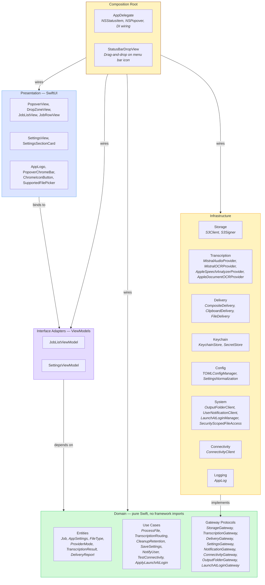
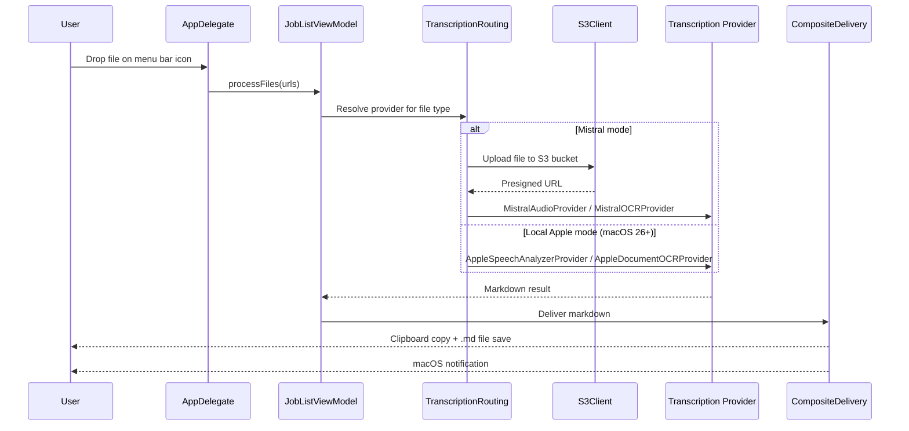

# trnscrb — Architecture

> Clean Architecture applied to a Swift macOS menu bar app.

## Layers

Dependencies always point inward — outer layers depend on inner layers, never the reverse.



## Data Flow

The core pipeline for every file drop:



## Folder Structure

```
trnscrb/
├── App/                              # Composition root
│   ├── TrnscrbrApp.swift             # @main SwiftUI entry point
│   ├── AppDelegate.swift             # NSStatusItem, NSPopover, DI wiring
│   └── StatusBarDropView.swift       # NSView drag-and-drop on menu bar icon
├── Domain/                           # Pure Swift — no framework imports
│   ├── Entities/
│   │   ├── Job.swift                 # State machine: uploading → processing → done/error
│   │   ├── AppSettings.swift         # User-configurable settings model
│   │   ├── FileType.swift            # Audio/PDF/image routing + extension sets
│   │   ├── ProviderMode.swift        # Mistral vs Local Apple per media type
│   │   ├── TranscriptionResult.swift # Markdown output from processing
│   │   └── DeliveryReport.swift      # Result of clipboard/file delivery
│   ├── UseCases/
│   │   ├── ProcessFileUseCase.swift  # Orchestrates upload → process → deliver
│   │   ├── TranscriptionRouting.swift # Resolves provider by file type + mode
│   │   ├── CleanupRetentionUseCase.swift # Deletes expired S3 objects
│   │   ├── SaveSettingsUseCase.swift # Persists settings + secrets
│   │   ├── NotifyUserUseCase.swift   # Sends macOS notifications
│   │   ├── TestConnectivityUseCase.swift # Validates S3/API credentials
│   │   └── ApplyLaunchAtLoginUseCase.swift # Toggles launch at login
│   └── Gateways/                     # Protocols only — owned by domain
│       ├── StorageGateway.swift
│       ├── TranscriptionGateway.swift
│       ├── DeliveryGateway.swift
│       ├── SettingsGateway.swift
│       ├── NotificationGateway.swift
│       ├── ConnectivityGateway.swift
│       ├── OutputFolderGateway.swift
│       └── LaunchAtLoginGateway.swift
├── Infrastructure/                   # Implements gateway protocols
│   ├── Storage/
│   │   ├── S3Client.swift            # S3-compatible upload/delete/presign
│   │   └── S3Signer.swift            # AWS Signature V4 signing
│   ├── Transcription/
│   │   ├── MistralAudioProvider.swift # Voxtral transcription endpoint
│   │   ├── MistralOCRProvider.swift   # OCR 3 for PDFs and images
│   │   ├── AppleSpeechAnalyzerProvider.swift # On-device audio (macOS 26+)
│   │   ├── AppleDocumentOCRProvider.swift    # On-device OCR (macOS 26+)
│   │   ├── MistralError.swift
│   │   └── LocalProviderError.swift
│   ├── Delivery/
│   │   ├── CompositeDelivery.swift   # Combines clipboard + file delivery
│   │   ├── ClipboardDelivery.swift
│   │   └── FileDelivery.swift
│   ├── Keychain/
│   │   ├── KeychainStore.swift       # macOS Keychain CRUD
│   │   └── SecretStore.swift         # High-level secret access
│   ├── Config/
│   │   ├── TOMLConfigManager.swift   # Reads/writes ~/.config/trnscrb/config.toml
│   │   └── SettingsNormalization.swift # Validates and normalizes config values
│   ├── System/
│   │   ├── OutputFolderClient.swift  # File system output folder access
│   │   ├── UserNotificationClient.swift # UNUserNotificationCenter wrapper
│   │   ├── LaunchAtLoginManager.swift # SMAppService wrapper
│   │   ├── SecurityScopedFileAccess.swift # Sandbox-ready bookmark handling
│   │   └── NotificationRuntimeSupport.swift # .app bundle detection for notifications
│   ├── Connectivity/
│   │   └── ConnectivityClient.swift  # NWPathMonitor network status
│   └── Logging/
│       └── AppLog.swift              # Unified os.Logger wrapper
└── Presentation/                     # SwiftUI views + ViewModels
    ├── ViewModels/
    │   ├── JobListViewModel.swift    # Job queue, processing, state management
    │   └── SettingsViewModel.swift   # Settings form binding + validation
    ├── Popover/
    │   ├── PopoverView.swift         # Root popover container
    │   ├── PopoverContentLayout.swift # Layout logic for popover content
    │   ├── DropZoneView.swift        # Drag-and-drop target + file picker
    │   ├── JobListView.swift         # Scrollable list of active/completed jobs
    │   ├── JobRowView.swift          # Single job row with status + actions
    │   └── JobRowPresentation.swift  # Row display logic (icons, colors, labels)
    ├── Settings/
    │   ├── SettingsView.swift        # Settings panel in popover
    │   └── SettingsSectionCard.swift  # Grouped settings card component
    └── Common/
        ├── AppLogo.swift             # Menu bar icon (embedded SVG)
        ├── PopoverDesign.swift       # Shared layout constants
        ├── PopoverChromeBar.swift    # Top bar with branding + controls
        ├── ChromeIconButton.swift    # Icon button for chrome bar
        ├── SupportedFilePicker.swift # NSOpenPanel wrapper for supported types
        └── PointingHandOnHoverModifier.swift # Cursor style modifier
```

## Key Design Decisions

**Gateway protocols are owned by the domain.** All 8 gateway protocols are defined in `Domain/Gateways/`. Infrastructure code imports and conforms to them. This is the dependency inversion that makes the architecture work — the domain never knows about S3, Mistral, or the file system.

**Per-media provider routing.** `TranscriptionRouting` resolves the correct provider based on `(FileType, ProviderMode, OS version)`. Each media type (audio, PDF, image) has an independent provider mode. Adding a new provider is additive: implement `TranscriptionGateway`, register it in routing.

**CompositeDelivery combines output channels.** Clipboard and file delivery are independent implementations of `DeliveryGateway`. `CompositeDelivery` wraps both so the use case layer doesn't need to know which outputs are enabled.

**Views are humble objects.** SwiftUI views bind to ViewModels via `@ObservedObject` and contain no business logic. The presentation layer is thin and testable through the ViewModels.

**AppDelegate is the only component that knows everything.** It creates concrete infrastructure instances, injects them into use cases, and wires ViewModels to views. No other layer has this cross-cutting knowledge.

**Single Mistral API key covers all cloud processing.** The settings layer stores one key in Keychain. Both Mistral providers receive it through dependency injection — no key management logic in the domain.
