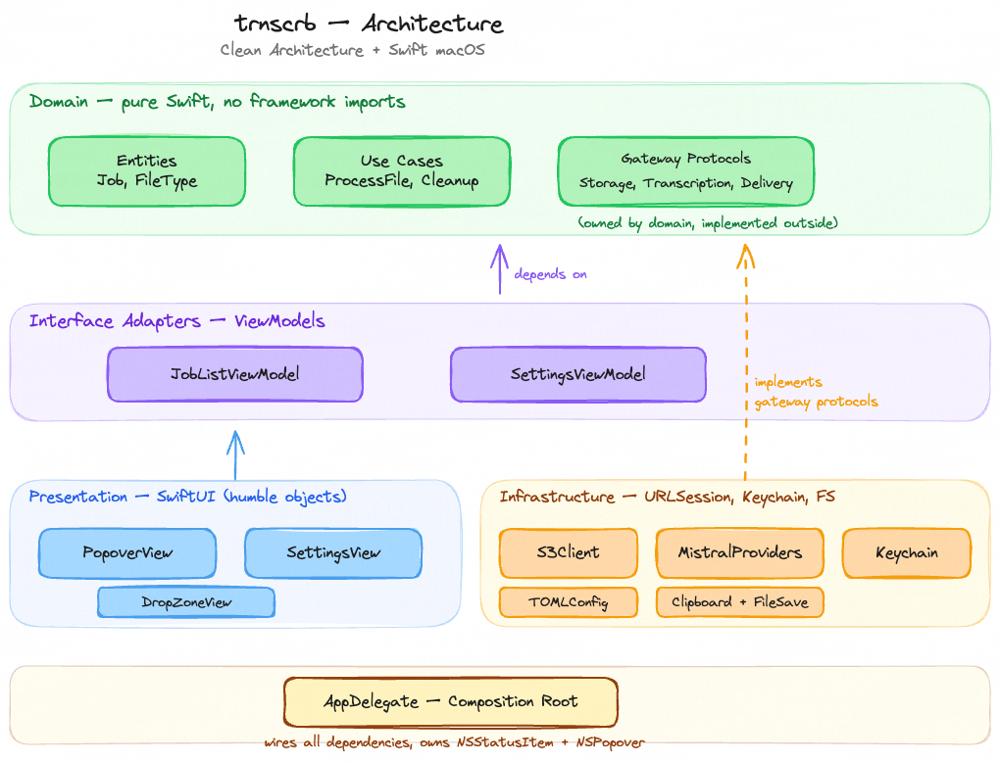
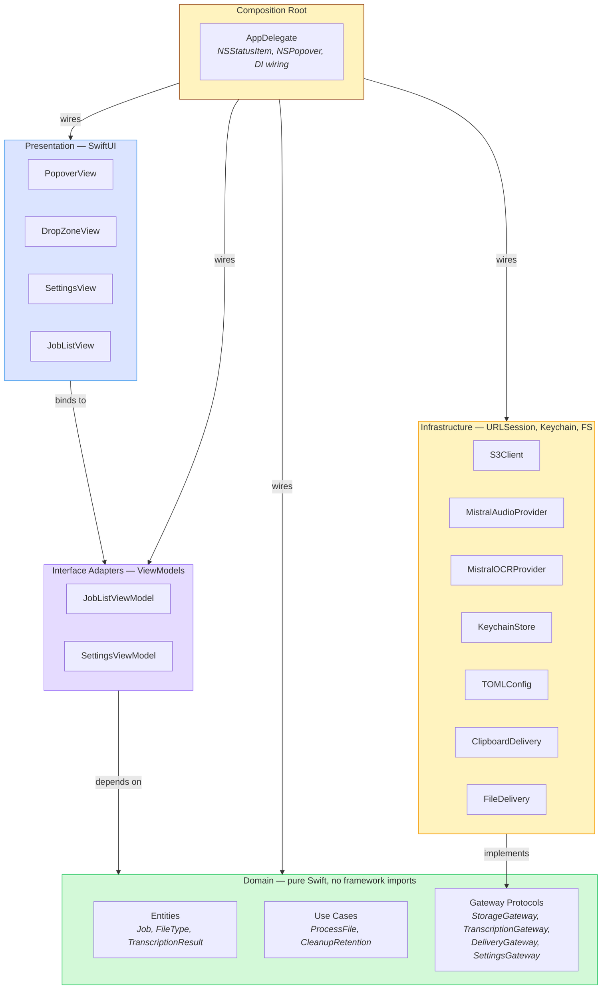
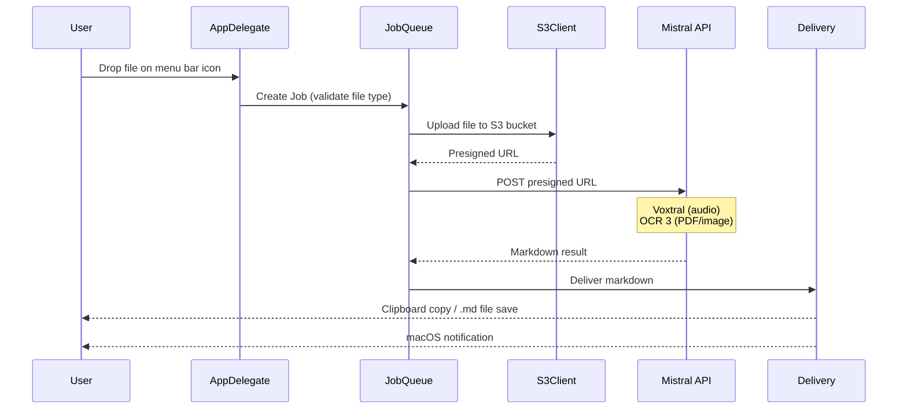

# trnscrb — Architecture

> Clean Architecture applied to a Swift macOS menu bar app.



## Layers

Dependencies always point inward — outer layers depend on inner layers, never the reverse.



## Data Flow

The core pipeline for every file drop:



## Folder Structure

```
trnscrb/
├── App/                          # Composition root
│   ├── trnscrb.swift             # @main entry point
│   └── AppDelegate.swift         # NSStatusItem, NSPopover, DI wiring
├── Domain/                       # Pure Swift — no framework imports
│   ├── Entities/
│   │   ├── Job.swift             # State machine: uploading → processing → done/error
│   │   ├── FileType.swift        # Audio/PDF/image routing + extension sets
│   │   └── TranscriptionResult.swift
│   ├── UseCases/
│   │   ├── ProcessFileUseCase.swift
│   │   └── CleanupRetentionUseCase.swift
│   └── Gateways/                 # Protocols only — owned by domain
│       ├── StorageGateway.swift
│       ├── TranscriptionGateway.swift
│       ├── DeliveryGateway.swift
│       └── SettingsGateway.swift
├── Infrastructure/               # Implements gateway protocols
│   ├── Storage/
│   │   └── S3Client.swift
│   ├── Transcription/
│   │   ├── MistralAudioProvider.swift
│   │   └── MistralOCRProvider.swift
│   ├── Delivery/
│   │   ├── ClipboardDelivery.swift
│   │   └── FileDelivery.swift
│   ├── Keychain/
│   │   └── KeychainStore.swift
│   └── Config/
│       └── TOMLConfigManager.swift
└── Presentation/                 # SwiftUI views + ViewModels
    ├── ViewModels/
    │   ├── JobListViewModel.swift
    │   └── SettingsViewModel.swift
    ├── Popover/
    │   ├── PopoverView.swift
    │   ├── DropZoneView.swift
    │   └── JobListView.swift
    └── Settings/
        └── SettingsView.swift
```

## Key Design Decisions

**Gateway protocols are owned by the domain.** `StorageGateway`, `TranscriptionGateway`, etc. are defined in `Domain/Gateways/`. Infrastructure code imports and conforms to them. This is the dependency inversion that makes the architecture work — the domain never knows about S3, Mistral, or the file system.

**Views are humble objects.** SwiftUI views bind to ViewModels via `@ObservedObject` / `@StateObject` and contain no business logic. This keeps the presentation layer thin and testable through the ViewModels.

**AppDelegate is the only component that knows everything.** It creates concrete infrastructure instances, injects them into use cases, and wires ViewModels to views. No other layer has this cross-cutting knowledge.

**TranscriptionGateway unifies audio and OCR.** Both `MistralAudioProvider` and `MistralOCRProvider` conform to the same protocol, so the `ProcessFileUseCase` routes by `FileType` without knowing which API is called.

**Single Mistral API key covers all processing.** The settings layer stores one key in Keychain. Both providers receive it through dependency injection — no key management logic in the domain.
