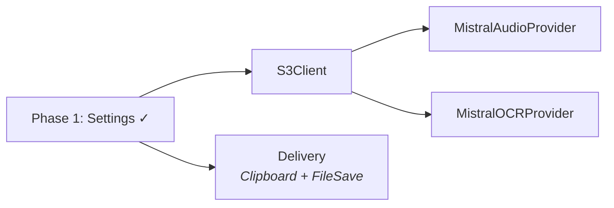

# trnscrb — High-Level Implementation Strategy

> Build order, dependencies, and parallelization opportunities.

```
Phase 0 ──► Phase 1 ──► Phase 2 ──► Phase 3 ──► Phase 4
scaffold     shell        pipeline    integration  polish
```

## Phase 0 — Project Scaffold

Everything else is blocked on this.

- Xcode project with folder structure from [ARCHITECTURE.md](ARCHITECTURE.md)
- Swift 6 strict concurrency (`SWIFT_STRICT_CONCURRENCY=complete`)
- SwiftLint with a strict config (force_cast, force_try, force_unwrapping as errors)
- Domain layer: all entities, all gateway protocols, use case signatures
- No implementations yet — just the types and contracts

This gives a compilable project where every later phase is just "fill in a protocol conformance" or "build a view that binds to a ViewModel."

## Phase 1 — Menu Bar Shell + Settings

Need to see something, and need credentials before any API work. These are sequential — each depends on the previous.

1. **Menu bar app** — `AppDelegate` with `NSStatusItem`, `NSPopover`, `.accessory` activation policy
2. **Settings persistence** — `TOMLConfigManager` (implements `SettingsGateway`), `KeychainStore`
3. **Settings UI** — `SettingsView` + `SettingsViewModel` inside the popover

## Phase 2 — Pipeline Components (parallelizable)

Once settings work, the infrastructure pieces can be built independently:



| Component            | Blocked by                              | Can parallel with     |
| -------------------- | --------------------------------------- | --------------------- |
| S3Client             | Settings (needs credentials)            | Delivery              |
| ClipboardDelivery    | Nothing                                 | Everything in Phase 2 |
| FileDelivery         | Nothing                                 | Everything in Phase 2 |
| MistralAudioProvider | S3Client (needs presigned URLs to test) | MistralOCRProvider    |
| MistralOCRProvider   | S3Client (needs presigned URLs to test) | MistralAudioProvider  |

## Phase 3 — Integration

Wire the pipeline end-to-end. This is where it becomes an app. Sequential — each builds on the previous.

1. **ProcessFileUseCase** — orchestrates S3 upload → Mistral call → delivery (needs all of Phase 2)
2. **Drag-and-drop** — `DropZoneView` + drop target on `NSStatusItem` button
3. **Job queue + progress** — `JobListViewModel` + `JobListView` in the popover

## Phase 4 — Polish

All independent of each other, do in any order:

- Batch/parallel processing (`TaskGroup`)
- Retry logic (exponential backoff for S3, single retry for Mistral)
- `RetentionCleaner` (background timer deletes expired S3 objects)
- macOS notifications (file ready, errors)
- Launch at login (`SMAppService`)
- Menu bar icon states (idle/processing animation/error badge)
- Recent results history in popover

## Strict Typing & Linting

Set up in Phase 0 so they enforce discipline from day one.

### Swift Compiler Flags

- `SWIFT_STRICT_CONCURRENCY=complete` — no implicit Sendable, no unstructured concurrency surprises
- `-warnings-as-errors` in release builds
- `-enable-upcoming-feature ExistentialAny` — forces `any Protocol` syntax, catches accidental existentials

### SwiftLint Rules (as errors)

- `force_cast`, `force_try`, `force_unwrapping` — use proper optionals
- `explicit_type_interface` on public declarations
- `missing_docs` on public APIs (at least gateway protocols)
- `file_length`, `function_body_length` — keeps things decomposed
- `identifier_name` — consistent naming

This means gateway protocols become the enforced contract — infrastructure that doesn't match the domain's types won't compile.
